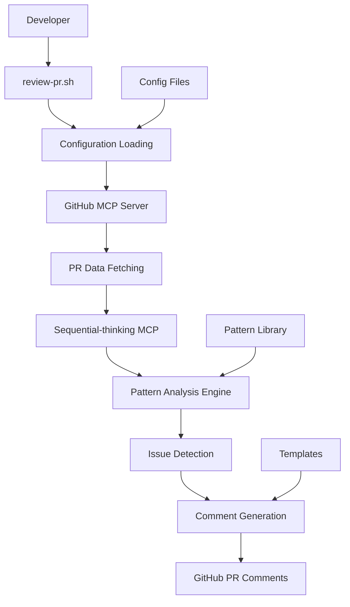

# Architecture Guide - Elixir Code Review Framework

This document describes the system architecture, design decisions, and technical implementation of the automated code review framework.

## System Overview



## Core Components

### 1. Pattern Library (`patterns/`)

The heart of the system - individual markdown files defining anti-patterns.

**Structure:**
```
patterns/
├── architectural/     # System-wide patterns
├── file-level/       # Individual file issues
├── one-liners/       # Simple mechanical fixes
└── integrations/     # Library-specific patterns
    ├── ecto/
    ├── phoenix/
    ├── bodyguard/
    └── mock/
```

**Pattern File Format:**
```yaml
---
title: "Pattern Name"
severity: critical|high|medium|low
category: architectural|file-level|one-liners|integrations
detection_method: regex|ast|semantic|hybrid
---

# Description, examples, solutions, detection rules
```

### 2. Configuration System (`config/`)

**repositories.yaml**: Target repositories and analysis settings
```yaml
repositories:
  project_name:
    owner: "GitHubOrg"
    name: "repo-name"
    patterns: ["architectural/*", "integrations/phoenix/*"]
    file_patterns: ["*.ex", "*.exs"]
```

**severity-levels.yaml**: Issue classification and time estimates
```yaml
severity_levels:
  critical:
    priority: 1
    require_immediate_fix: true
    block_merge: true
```

**github-templates.yaml**: Comment formatting and PR integration
```yaml
templates:
  critical:
    emoji: "🚨"
    template: "{emoji} **CRITICAL** {title}..."
```

### 3. Automation Scripts (`scripts/`)

**review-pr.sh**: Main orchestration script
- Command-line interface
- Configuration loading
- MCP server coordination
- Result processing

**install.sh**: Setup and dependency checking
- Prerequisite validation
- Configuration initialization
- System integration

### 4. MCP Server Integration

The system leverages three key MCP servers:

#### GitHub MCP Server
- **Purpose**: Repository operations, PR analysis, comment creation
- **Key Functions**:
  - `list_pull_requests`: Get open PRs
  - `get_pull_request_diff`: Analyze changes
  - `create_pull_request_review`: Add comments
  - `get_file_contents`: Access repository files

#### Sequential-thinking MCP Server  
- **Purpose**: Complex architectural analysis and reasoning
- **Key Functions**:
  - Deep pattern analysis
  - Multi-step reasoning about code quality
  - Contextual understanding of architectural issues

#### Browser MCP Server (Optional)
- **Purpose**: Documentation research and external references
- **Key Functions**:
  - Fetch documentation for libraries
  - Research best practices
  - Validate pattern recommendations

## Analysis Engine Design

### 1. Pattern Detection Pipeline

```
PR Changes → File Analysis → Pattern Matching → Issue Generation → Comment Creation
```

**Stage 1: File Analysis**
- Extract changed files from PR diff
- Filter by file patterns (*.ex, *.exs)
- Parse file content and AST structure

**Stage 2: Pattern Matching**
- Apply regex patterns for quick detection
- Use AST analysis for structural issues
- Leverage semantic analysis for complex patterns

**Stage 3: Issue Generation**
- Combine detection results
- Apply severity classification
- Generate code examples and fixes

**Stage 4: Comment Creation**
- Format using GitHub templates
- Group similar issues
- Create targeted PR comments

### 2. Detection Methods

#### Regex Detection
```yaml
detection_method: regex
patterns:
  - "Phoenix\\.PubSub\\.broadcast\\([^,]+,\\s*[\"'](?P<generic_topic>circles|users)[\"']"
```

**Pros**: Fast, precise for simple patterns
**Cons**: Limited to surface-level text matching
**Use Cases**: Import violations, naming conventions, simple anti-patterns

#### AST (Abstract Syntax Tree) Analysis
```elixir
defmodule PatternDetector do
  def detect_pattern(ast_node) do
    # Traverse AST structure
    # Look for specific node patterns
    # Return findings with context
  end
end
```

**Pros**: Understands code structure, context-aware
**Cons**: More complex, language-specific
**Use Cases**: Function complexity, control flow issues, structural problems

#### Semantic Analysis
```text
Analyze this Elixir code for manual authorization bypassing Bodyguard patterns:
- Look for functions with authorization-related names
- Flag cond statements checking user roles directly
- Identify inline authorization logic in controllers
```

**Pros**: Understands intent and context, handles complex cases
**Cons**: Requires AI analysis, potentially slower
**Use Cases**: Architectural violations, security patterns, complex business logic

### 3. Hybrid Approach

Many patterns use multiple detection methods:

1. **Regex**: Initial screening for potential issues
2. **AST**: Structural validation and context extraction
3. **Semantic**: Final validation and nuanced analysis

This provides optimal balance of speed, accuracy, and comprehensiveness.

## Integration Architecture

### 1. Claude Code Integration

```bash
superclaude <<EOF
# Multi-tool orchestration
1. Use GitHub MCP to fetch PR data
2. Use Sequential-thinking MCP for analysis
3. Apply pattern library rules
4. Generate formatted comments
5. Post results back to GitHub
EOF
```

**Benefits**:
- Single interface for multiple MCP servers
- Intelligent orchestration and error handling
- Rich context understanding
- Natural language instruction processing

### 2. GitHub Integration

**PR Comment Strategy**:
- Individual comments for each issue
- Summary comment with overall metrics
- Threaded discussions for complex issues
- Links to pattern documentation

**Comment Targeting**:
- Specific line numbers from detection
- File-level comments for architectural issues
- PR-level summary for overall assessment

### 3. Configuration Management

**Layered Configuration**:
1. **Default**: Framework defaults
2. **Global**: User-specific settings
3. **Project**: Repository-specific overrides
4. **Runtime**: Command-line parameters

**Configuration Validation**:
- YAML syntax checking
- Required field validation
- Pattern file integrity
- MCP server connectivity

## Scalability Considerations

### 1. Performance Optimization

**Pattern Matching Efficiency**:
- Regex patterns compiled once and reused
- File-level caching for repeated analysis
- Parallel processing of independent files
- Smart pattern selection based on file types

**Analysis Scope Management**:
- Focus on changed files only
- Configurable file pattern filtering
- Optional incremental analysis modes
- Batch processing for similar issues

### 2. Extensibility Design

**Pattern Addition**:
- Standardized pattern template
- Automatic pattern discovery
- Version-controlled pattern library
- Community contribution workflow

**Integration Points**:
- Pluggable detection methods
- Custom comment templates
- External tool integration
- API endpoints for automation

### 3. Maintenance Strategy

**Pattern Quality Assurance**:
- Automated pattern validation
- False positive tracking
- Effectiveness metrics
- Regular pattern reviews

**System Updates**:
- Backward-compatible configuration
- Graceful degradation for missing components
- Automated dependency checking
- Version-specific migration guides

## Security Considerations

### 1. Data Privacy

- **Repository Access**: Limited to configured repositories
- **Code Analysis**: Performed locally without external data transmission
- **GitHub Integration**: Uses official APIs with proper authentication
- **Sensitive Data**: No persistent storage of repository content

### 2. Authentication

- **GitHub MCP**: Uses Claude Code's authentication system
- **Repository Permissions**: Respects GitHub repository access controls
- **API Tokens**: Managed through Claude Code configuration
- **Audit Trail**: All actions logged through GitHub's audit system

### 3. Pattern Security

- **Malicious Patterns**: Validation prevents execution of unsafe patterns
- **Input Sanitization**: Regex patterns validated before compilation
- **Output Filtering**: Generated comments sanitized before posting
- **Access Control**: Pattern modifications require repository access

## Monitoring and Metrics

### 1. Usage Metrics

- **Reviews Performed**: Track review frequency and scope
- **Issues Detected**: Count by severity and category
- **Resolution Rates**: Track fix adoption and time-to-resolution
- **Cost Savings**: Calculate time and cost benefits

### 2. Quality Metrics

- **False Positive Rate**: Track pattern accuracy
- **Detection Coverage**: Measure pattern effectiveness
- **Performance Metrics**: Analysis time and resource usage
- **User Satisfaction**: Feedback on review quality

### 3. System Health

- **MCP Server Status**: Monitor server availability
- **Configuration Validation**: Track configuration issues
- **Error Rates**: Monitor and alert on system failures
- **Pattern Library Health**: Track pattern update frequency

## Future Architecture Plans

### 1. Real-time Integration

- **IDE Extensions**: VS Code, IntelliJ integration
- **Pre-commit Hooks**: Local analysis before commits
- **Live Analysis**: Real-time feedback during development
- **Collaborative Features**: Team-based pattern sharing

### 2. Advanced Analytics

- **Machine Learning**: Pattern discovery from codebase analysis
- **Trend Analysis**: Track code quality metrics over time
- **Predictive Modeling**: Anticipate common issues
- **Custom Dashboards**: Team-specific quality metrics

### 3. Multi-language Support

- **Language Abstraction**: Generic pattern framework
- **Language-specific Modules**: TypeScript, Python, Go support
- **Cross-language Patterns**: Architecture patterns across languages
- **Polyglot Repository Support**: Mixed-language codebases

---

*Last updated: 2025-08-19*  
*Architecture version: 1.0*